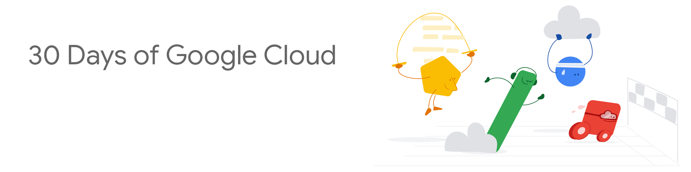
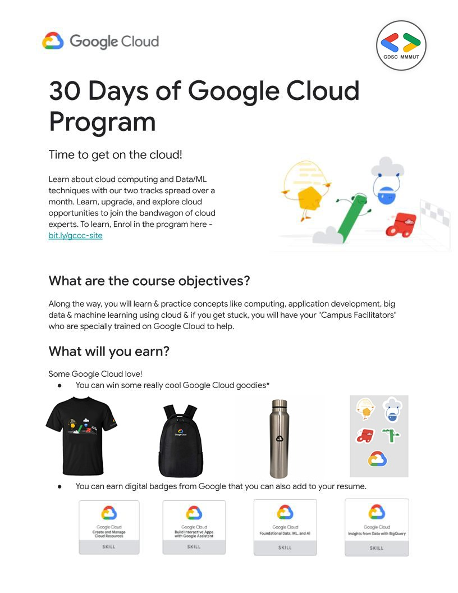
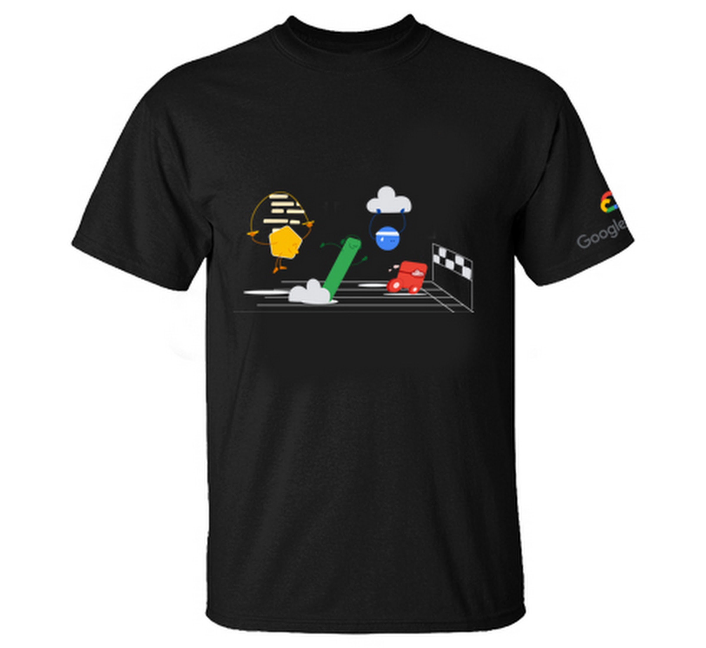
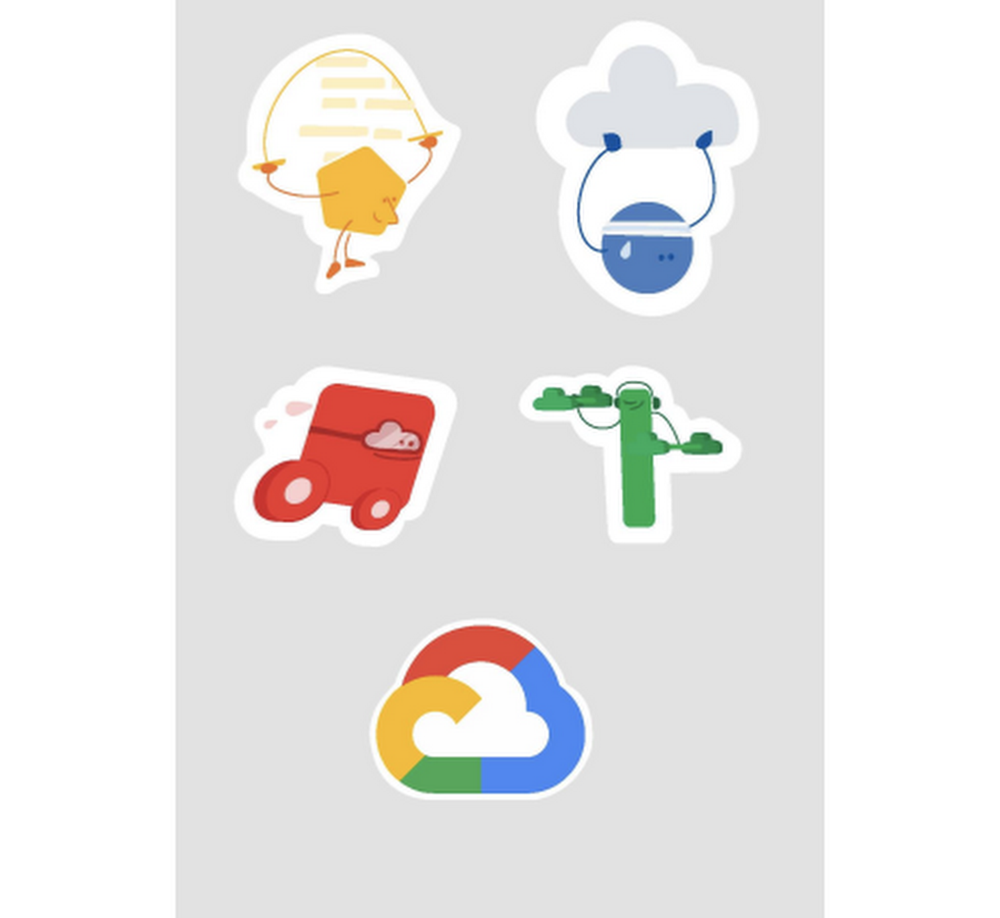

# 30-days-of-GCP-Full-Guide-And-Resources

 

## What is 30 Days of Google Cloud?

30 Days of Google Cloud program will provide you an opportunity to kickstart your career in cloud and get hands-on practice on Google Cloud - the tool that powers apps like Google Search, Gmail and YouTube.

Along the way, you will learn & practice concepts like computing, application development, big data & machine learning using cloud & if you get stuck, you will have your "Campus Facilitators" who are specially trained on Google Cloud to help. 

## For More Infprmation checkout the [Official Website](https://events.withgoogle.com/30daysofgooglecloud/)

### First Make a New Account on [Qwiklabs](https://www.qwiklabs.com/)

If you have completed any quest before , then do not use that account and mail , make a new account with a new mail id on qwiklabs.

## Tracks

### Track 1: Cloud Engineering Track
1. Skill Badge: [Getting Started: Create and Manage Cloud Resources](https://google.qwiklabs.com/quests/120)
    - A Tour of Qwiklabs and Google Cloud [video solution](https://www.youtube.com/watch?v=s9NRS2D9Q6E&t=58s)
    - Creating a Virtual Machine [video solution](https://www.youtube.com/watch?v=Co34im5mgGA)
    - Getting Started with Cloud Shell and gcloud [video solution](https://www.youtube.com/watch?v=bMVBLE4dJRk&t=101s)
    - Kubernetes Engine: Qwik Start [Video Solution](https://www.youtube.com/watch?v=Gvb2CjxbE50&t=130s)
    - Set Up Network and HTTP Load Balancers [Video Solution](https://www.youtube.com/watch?v=TvEZlhLgoQk)
    - Create and Manage Cloud Resources: Challenge Lab [Video Solution](https://www.youtube.com/watch?v=j8HbCVVjRQw&t=96s)

2. Skill Badge: [Perform Foundational Infrastructure Tasks in Google Cloud](https://google.qwiklabs.com/quests/118)
   - Cloud Storage: Qwik Start - Cloud Console [Video Solution](https://www.youtube.com/watch?v=tIJ1CABM2f0)
   - Cloud IAM: Qwik Start [Video Solution](https://www.youtube.com/watch?v=fz3va_hDjbQ&t=172s)
   - Cloud Monitoring: Qwik Start [Video Solution](https://www.youtube.com/watch?v=JK6VRQm79KM)
   - Cloud Functions: Qwik Start - Console [Video Solution](https://www.youtube.com/watch?v=sZo58_0ZOhM)
   - Google Cloud Pub/Sub: Qwik Start - Console [Video Solution](https://www.youtube.com/watch?v=2Lsz9zzQ7GQ)
   - Perform Foundational Infrastructure Tasks in Google Cloud: Challenge Lab [Video Solution](https://www.youtube.com/watch?v=aLmNzIYhY6U)

3. Skill Badge: [Setup and Configure a Cloud Environment in Google Cloud](https://google.qwiklabs.com/quests/119?utm_source=google&utm_medium=lp&utm_campaign=gcpskills)
   - Cloud IAM: Qwik Start [Video Solution](https://www.youtube.com/watch?v=jbW70MdoeXI)  
   - Introduction to SQL for BigQuery and Cloud SQL [Video Solution](https://www.youtube.com/watch?v=_tlxlUroWUI)
   - Multiple VPC Networks [Video Solution](https://www.youtube.com/watch?v=noGN5wr-9DU)
   - Cloud Monitoring: Qwik Start [Video Solution](https://www.youtube.com/watch?v=M-t_tXM-xXU)
   - Managing Deployments Using Kubernetes Engine [Video Solution](https://www.youtube.com/watch?v=GqrnGuJEIR4)
   - Set Up and Configure a Cloud Environment in Google Cloud: Challenge Lab [Video Solution](https://www.youtube.com/watch?v=w77Rh05vFCg&t=136s)
4. Skill Badge: [Deploy and Manage Cloud Environments with Google Cloud](https://google.qwiklabs.com/quests/121?utm_source=google&utm_medium=lp&utm_campaign=gcpskills)

5. Skill Badge: [Build and Secure Networks in Google Cloud](https://google.qwiklabs.com/quests/128?utm_source=google&utm_medium=lp&utm_campaign=gcpskills)

6. Skill Badge: [Deploy to Kubernetes in Google Cloud](https://google.qwiklabs.com/quests/116?utm_source=google&utm_medium=lp&utm_campaign=gcpskills)

### Track 2: Data Science & Machine Learning Track
1. Skill Badge: [Getting Started: Create and Manage Cloud Resources](https://google.qwiklabs.com/quests/120)

2. Skill Badge: [Perform Foundational Data, ML, and AI Tasks in Google Cloud](https://google.qwiklabs.com/quests/117?utm_source=google&utm_medium=lp&utm_campaign=gcpskills)

3. Skill Badge: [Insights from Data with BigQuery](https://google.qwiklabs.com/quests/123?utm_source=google&utm_medium=lp&utm_campaign=gcpskills)

4. Skill Badge: [Engineer Data in Google Cloud](https://google.qwiklabs.com/quests/132)

5. Skill Badge: [Integrate with Machine Learning APIs](https://google.qwiklabs.com/quests/136?utm_source=google&utm_medium=lp&utm_campaign=gcpskills)

6. Skill Badge: [Explore Machine Learning Models with Explainable AI](https://google.qwiklabs.com/quests/126?utm_source=google&utm_medium=lp&utm_campaign=gcpskills)

## Rules for availing the prizes
To earn prizes in the program, you need to complete either of the track!

See the tracks and the prizes associated with them below. They will record your progress on a daily basis and will evaluate it at the end of the program i.e. 27th October 11:59 PM IST.

You will receive more information on how to avail your Google Cloud goodies after the program ends ONLY if you are eligible for prizes.

## Prize #1 - Complete any one track - Track 1 or Track 2

<b>Prize #1</b> - Complete any one track - Track 1 or Track 2
You can earn the prize* given below by completing all the labs and getting all skill badges that are part of either of the given tracks in the program syallabus i.e. <b>Cloud Engineering Track or Data Science and Machine Learning Track.</b>

#### <b>Note: Only the skill badge completions after your enrolment date will be counted. Any skill badges completed before that won't be taken into account for this.</b>

### Rewards for completing any one track

  
 

## Prize #2: Complete both the tracks

You can earn the prize* given alongside by completing all the skill badges from both the tracks <b>(Cloud Engineering Track and Data Science & Machine Learning Track)</b> that are part of the program.

#### <b>Note: This prize is not in addition to the above mentioned prizes on completing individual tracks.</b>

  

### Rewards for completing both Tracks

